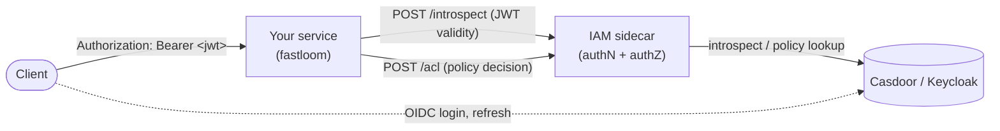

# Auth

Fastloom services authenticate against a companion **IAM microservice** — either **Casdoor** or **Keycloak** — through a thin sidecar that bundles the authN (`/introspect`) and authZ (`/acl`) endpoints. Both are plain HTTP calls; fastloom does **not** verify JWT signatures locally and does **not** share signing keys with the IAM. Claims are parsed unverified, and validity is established only via the introspection call when `INTROSPECT=True`.

Parsed claims are stashed in a context variable so downstream code (signal handlers, background tasks) can read them without re-injecting.

**Symbols at a glance**

- `fastloom.auth.depends.JWTAuth` — required JWT dependency (`auto_error=True`).
- `fastloom.auth.depends.OptionalJWTAuth` — same, but yields `None` when no token is present.
- `fastloom.auth.schemas.UserClaims` — normalized user claims.
- `fastloom.auth.settings.IAMSettings` — composed of `OAuth2MergedScheme` + `OIDCCScheme` + introspection knobs.
- `fastloom.auth.Claims` — `ContextVar[UserClaims]` set on successful validation.

## IAM topology



- The IAM microservice (Casdoor or Keycloak) issues OIDC tokens. Set `OIDC_URL` (or `authorizationUrl` + `tokenUrl`) to point Swagger and clients at it.
- The sidecar is a deployment-local process in front of the IAM microservice. It exposes:
  - `POST /introspect` — forwards the token to the IAM for JWT inspection (validity, revocation, claims). Called when `INTROSPECT=True`.
  - `POST /acl` — performs the policy check (may this token call this path with this method?). Called when `ACL=True`.
- Fastloom services hit the sidecar via `IAM_SIDECAR_URL`. No direct calls from services to Casdoor / Keycloak — the sidecar is the only boundary, so policy and IAM-backend changes don't need fan-out across every service.
- Signing keys are **not** shared with services. Fastloom uses `jose.jwt.get_unverified_claims` to parse the token; trust comes from the introspection round-trip, not from a local signature check. Don't enable `INTROSPECT=False` in production unless the network path between client and service is already trusted (e.g. internal mesh with mTLS).

## `IAMSettings`

The IAM settings mixin combines OIDC discovery and OAuth2 endpoints, plus toggles for the introspection sidecar:

```python
class IAMSettings(OAuth2MergedScheme, OIDCCScheme):
    INTROSPECT: bool = False
    ACL: bool = False
    IAM_SIDECAR_URL: HttpUrl | None = None

    # from OIDCCScheme:
    OIDC_URL: HttpUrl | None = None  # enables OpenIdConnect when set

    # from OAuth2MergedScheme:
    authorizationUrl: HttpUrl | None = None
    tokenUrl: HttpUrl | None = None
    # ... plus OAuth2 flow fields
```

Auth mode is chosen by which fields are set:

| Setting | Behavior |
|---------|----------|
| `OIDC_URL` set | `OpenIdConnect` security scheme (preferred). |
| `authorizationUrl` + `tokenUrl` set | `OAuth2` security scheme with authorization-code flow. |
| Neither | No security scheme — auth dependencies will pass through. |
| `INTROSPECT=True` | Every validated token is sent to `{IAM_SIDECAR_URL}/introspect`; rejected if `active=False`. |
| `ACL=True` | Every request is sent to `{IAM_SIDECAR_URL}/acl` with the path + method; rejected on non-200 or falsy body. |

`BaseGeneralSettings` already includes `IAMSettings`, so a service that uses `BaseGeneralSettings` only needs to fill the relevant fields in `tenants.yaml`.

## Protecting routes

The `TC` singleton exposes two ready-to-go dependencies:

- `TC.auth.get_claims` — required; returns `UserClaims`.
- `TC.optional_auth.get_claims` — optional; returns `UserClaims | None`.
- `TC.auth.get_token` / `TC.optional_auth.get_token` — raw string token (after stripping the `Bearer ` prefix).

```python
from typing import Annotated

from fastapi import APIRouter, Depends

from fastloom.auth.schemas import UserClaims

from settings import TC

router = APIRouter()


@router.get("/me")
async def me(
    claims: Annotated[UserClaims, Depends(TC.auth.get_claims)],
) -> dict[str, object]:
    return {
        "id": str(claims.id),
        "username": claims.username,
        "tenant": claims.tenant,
        "is_admin": claims.is_admin,
    }


@router.get("/public")
async def public(
    claims: Annotated[UserClaims | None, Depends(TC.optional_auth.get_claims)],
):
    return {"authenticated": claims is not None}
```

Routes that don't depend on `get_claims` are unauthenticated by default — `TC.auth` doesn't apply globally.

## `UserClaims` shape

```python
class UserClaims(BaseModel):
    iss: HttpUrl
    id: UUID = Field(alias="sub")
    sid: str
    username: str = Field(alias="preferred_username")
    name: str
    given_name: str
    family_name: str
    roles: list[str] = []
    email: str
    email_verified: bool
    scope: set[str]            # split from space-delimited string
    groups: set[str] = set()
    organizations: dict[str, OrganizationAttributes] = {}

    # computed:
    tenant: str                # last path segment of `iss`
    organization: Organization | None
    is_admin: bool             # "ADMIN" in roles
```

- `tenant` is derived from the JWT issuer (`iss.path` final segment) — make sure the IAM realm path matches your tenant name.
- `organization` is the first entry of `organizations` (or `None`).
- `is_admin` matches `ADMIN` (constant `fastloom.auth.schemas.ADMIN_ROLE`).
- JSON serialization uses claim aliases (`sub`, `preferred_username`) and re-joins `scope` into a space-delimited string.

## Reading claims outside of a request

`Claims` is set on every successful `_validate_token` call. Use it from FastStream subscribers, background tasks, or domain code that shouldn't take a FastAPI dependency:

```python
from fastloom.auth import Claims

claims = Claims.get()
do_something(claims.id)
```

`Claims.get()` raises `LookupError` if no token has been validated in the current context — guard accordingly.

## Sidecar contract

When `INTROSPECT=True` or `ACL=True`, the configured sidecar receives:

- `POST {IAM_SIDECAR_URL}/introspect`, body `{"token": "..."}` → `{"active": true|false}`.
- `POST {IAM_SIDECAR_URL}/acl`, body `{"token": "...", "endpoint": "/api/...", "method": "GET"}` → JSON truthy/falsy.

Both calls use `httpx.AsyncClient` with default timeouts. Non-200 responses become `HTTPException(403)`. Failures inside the sidecar (e.g. policy engine down, IAM unreachable) propagate to the caller as 403 — fail-closed.

For local development you can run the full stack (Casdoor or Keycloak + sidecar) with the compose file shipped by the IAM project. If you set `INTROSPECT=False` and `ACL=False`, fastloom skips the sidecar entirely and parses the JWT's claims **without verifying the signature** — only acceptable when the network path to the service is otherwise trusted.

## Testing

The `fastloom.test.fixtures.auth` module patches both sidecar calls (`_acl` and `_introspect`) via an `autouse` fixture, so tests run without an IAM dependency while still exercising the real JWT parsing path. See [test.md](test.md).

## Related

- [Settings](settings.md) — adding `IAMSettings` to your `Settings` class via `BaseGeneralSettings`.
- [Tenant](tenant.md) — how `UserClaims.tenant` flows into the tenant DI sources.
