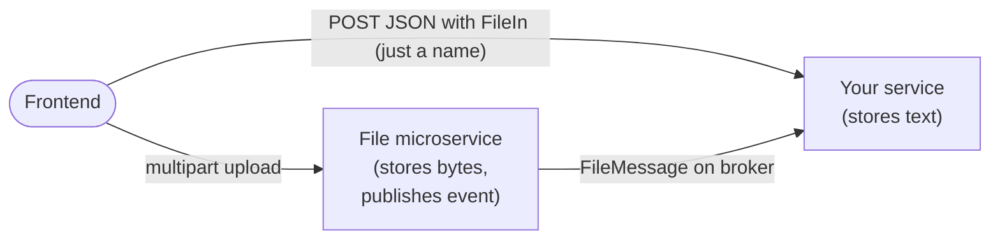

# File storage

Fastloom doesn't store bytes itself — that's the job of the separate **File microservice** (S3-compatible, MinIO-backed). What this module ships is the **pydantic schemas and Beanie models** every other service needs in order to participate in the outbox-style matching protocol the File service uses.

## The problem: two parallel uploads

When a user submits a form that contains text fields *and* a file, the browser typically issues two parallel requests:



The two arrows landing on **Your service** (the JSON form from the frontend and the `FileMessage` event from the file microservice) can arrive in **either order**. Naive code racing both would either:

- Reject the form because the file isn't visible yet (FE → service won the race).
- Forget the form's text because the upload-completed event arrived first and there was nothing to attach it to (FE → file-ms won).

The matching protocol turns this race into an outbox: every file row is recorded with a `matched` flag, and the two halves are reconciled asynchronously. The user sees the file once both sides agree.

## The four schema types

| Symbol | Where it appears | Shape | Purpose |
|--------|------------------|-------|---------|
| `FileIn` | **Frontend → your service** (request body) | `{ "name": str } \| None` | The frontend only knows the filename it asked the file service to store. It sends just that name. |
| `FileMessage` | **File microservice → broker** (event payload) | name + usage + metadata + path + content_type + content_length + tenant | The bytes-landed event. Carries everything needed to populate a `FileObject`. |
| `FileObject` | **Stored in your service's DB** | Beanie `Document`, requires path + content_type + metadata | Canonical "this file exists in object storage" record. Inserted on `FileMessage` (idempotent via `(name, tenant)` unique index). |
| `FileField` = `MatchedFile \| UnmatchedFile` | **Your service → frontend** (response body) | Discriminated union with a `matched: bool` flag | The shape the client reads back. Reflects whether the file is fully reconciled or still pending. |

Receive `FileIn`, save `FileObject`, respond with `FileField`. `FileReference` (described below) is the outbox holding row for the in-between state.

## The `matched` invariant

```python
class BaseFile(Filename, FileContentData):
    path: MediaPath = None
    matched: bool

    @model_validator(mode="after")
    def validate_content_length_and_matched(self):
        assert (
            (self.path is None)
            == (self.content_type is None)
            == (self.content_length is None)
            == (not self.matched)
        )
        return self
```

A `BaseFile` is valid only when **all four** of (`path`, `content_type`, `content_length`, `matched`) agree — either all set and `matched=True`, or all `None`/`False`. The two concrete subclasses encode that with literal types:

| Class | `matched` | `path` | `content_type` | `content_length` |
|-------|-----------|--------|----------------|------------------|
| `UnmatchedFile` | `Literal[False]` | `None` | `None` | `None` |
| `MatchedFile` | `Literal[True]` | required `Path` | required `str` | `int` (default `-1`) |

`FileField = MatchedFile | UnmatchedFile` is the discriminated union with **left-to-right** preference, so a payload that looks matched will validate as `MatchedFile` first.

```python
from pydantic import BaseModel
from fastloom.file.schema import FileIn, FileField, OptionalFileField, Filename


class CreateUserIn(BaseModel):
    avatar: FileIn = None             # frontend sends `{"name": "..."}` or omits it
    kyc_document: Filename            # required: just `{"name": "..."}`


class UserOut(BaseModel):
    avatar: OptionalFileField         # response carries the matched/unmatched state
    kyc_document: FileField           # client can render a placeholder until matched=True
```

The frontend submits only the name it received from the File service's "prepare upload" call — no path, no content type. Your service then stores a `FileObject` (once the broker event arrives) and replies with the discriminated `FileField` so the client knows whether to render the file or a "still uploading" placeholder.

## `FileMessage` wire format

This is the broker payload the File microservice publishes after a successful upload:

```python
class FileMessage(Filename, FileContentData):
    name: str
    usage: StrEnum
    metadata: FileMetaData
    path: RequiredMediaPath
    tenant: str = Field(validation_alias="bucket")   # the MinIO bucket is the tenant
```

Subscribe with the standard `RabbitSubscriber` decorator: insert the canonical `FileObject`, then upgrade any matching domain record to `MatchedFile`:

```python
from fastloom.signals.depends import RabbitSubscriber
from fastloom.file.schema import FileMessage, MatchedFile
from fastloom.file.models import FileObject


@RabbitSubscriber.subscriber(routing_key="file.uploaded")
async def on_file_uploaded(msg: FileMessage) -> None:
    # Idempotent: (name, tenant) is a unique index.
    await FileObject.model_validate(msg.model_dump()).insert()

    record = await UserDoc.find_one(UserDoc.kyc_document.name == msg.name)
    if record is None:
        # Form hasn't arrived yet — FileObject is the only state for now;
        # the inbound POST will pick it up when it lands.
        return
    record.kyc_document = MatchedFile.model_validate(msg.model_dump())
    await record.save()
```

The inverse path (form arrives first): your POST handler receives `FileIn`, looks up `FileObject` by name; if present, store a `MatchedFile` on the domain record; if absent, store an `UnmatchedFile` (or a `FileReference` outbox row) and let the eventual `FileMessage` upgrade it.

## Beanie models

```python
class FileObject(Document, TenantMixin):
    class Settings:
        name = "files"
        indexes = [IndexModel(["name", "tenant"], unique=True)]

    name: str
    usage: StrEnum
    metadata: FileMetaData
    content_type: str
    path: RequiredMediaPath


class FileReference(Document, TenantMixin, BaseFile, CreatedUpdatedAtSchema):
    class Settings:
        name = "file_references"
        indexes = [
            IndexModel(
                ["created_at"],
                expireAfterSeconds=60 * 60 * 24 * 7,  # 7 days
                partialFilterExpression={"matched": False},
                name="expire_after_7_days",
            ),
        ]

    usage: StrEnum
```

- `FileObject` — canonical record of a *bytes-on-disk* file. Unique on `(name, tenant)` to prevent cross-tenant collisions.
- `FileReference` — the outbox row. Unmatched references **auto-expire after 7 days** via the partial TTL index, so failed half-uploads don't accumulate. Once `matched=True`, the partial filter excludes it from the TTL and the row lives indefinitely.

`usage` is left as a generic `StrEnum` — subclass and narrow it to your domain's tags (e.g. `avatar`, `kyc_document`, …).

## Path coercion

`MediaPath` accepts `str`, `Path`, `dict` (looks at `"path"`), or any `BaseFile`-like object (`file.path or file.name`). It serializes back to a plain string. Use `RequiredMediaPath` when the path must be present (e.g. on `FileObject`).

## Related

- [db.md](db.md) — `CreatedUpdatedAtSchema`, `TenantMixin`, model auto-discovery.
- [signals.md](signals.md) — consuming `FileMessage` events.
